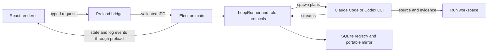

# Gauntlet Gamesmith architecture

This guide describes the desktop implementation as of 2026-09-05. Use it to find the owner of a
behavior before changing or reviewing it. [STANDARDS.md](STANDARDS.md) defines review requirements;
[DECISIONS.md](DECISIONS.md) records policy and architectural decisions. The original
[HANDOFF.md](../HANDOFF.md) is historical: its `packages/contracts`, Zod, separate storage adapters,
and multi-arm experiment design are not the current layout (ADR-005).

## Repository and process boundaries

The pnpm workspace includes `apps/*`; its implemented application is `apps/desktop`
(`@gauntlet/desktop`). Root scripts delegate to that package. Electron hosts the loop executor in
its main process and the React UI in its renderer. Agent CLIs and game previews are child processes;
there is no separate daemon service or remote coordinator.

| Location | Responsibility and allowed dependencies |
| --- | --- |
| [`apps/desktop/src/main/`](../apps/desktop/src/main/) | Electron startup, IPC handlers, orchestration, filesystem, SQLite, CLI processes, and preview serving. |
| [`apps/desktop/src/preload/`](../apps/desktop/src/preload/) | Narrow `contextBridge` APIs for requests and event subscriptions. This is the renderer's bridge to privileged operations. |
| [`apps/desktop/src/renderer/`](../apps/desktop/src/renderer/) | React views, user input, and rendering state received through preload. No direct filesystem, SQLite, or child-process access. |
| [`apps/desktop/src/shared/`](../apps/desktop/src/shared/) | Environment-neutral TypeScript contracts, prompts, model selection, and pure helpers used by main and renderer. No imports from Node, Electron, or main. |
| [`apps/desktop/scripts/`](../apps/desktop/scripts/) and [`apps/desktop/build/`](../apps/desktop/build/) | Packaging/verification scripts and application branding assets. |
| [`vendor/img2threejs/`](../vendor/img2threejs/) | Bundled asset-generation skill copied into the app-managed Claude skill store when sculpting is needed. |

[`main/index.ts`](../apps/desktop/src/main/index.ts) wires the ledger, runner, login, preview, and IPC
capabilities together. [`shared/ipc.ts`](../apps/desktop/src/shared/ipc.ts) names the channels;
[`preload/index.ts`](../apps/desktop/src/preload/index.ts) exposes the APIs, including
`window.harnesses`, `window.loops`, and `window.onboarding`. Main treats received values as
`unknown` and validates them through [`main/ipc-input.ts`](../apps/desktop/src/main/ipc-input.ts)
or capability-specific validators. Expected failures return explicit results. State and log pushes
reach the renderer through subscriptions with cleanup functions (ARCH-001/002).

## Loop execution

The UI calls the overall job a **run**. In [`shared/loop.ts`](../apps/desktop/src/shared/loop.ts), a
`LoopRecord` owns its goal, workspace, configuration, budget, and overall status. A `RunRecord` is
one attempt at one role and round, with its own status, prompt, session, metrics, and result.
Retries create additional attempts for the same role and round. `maxRounds` counts implementation
rounds, excluding the round-zero Reference Study.

[`main/loop-runner.ts`](../apps/desktop/src/main/loop-runner.ts) owns start, dispatch, supervision,
stop, retry, and recovery. [`main/round-planner.ts`](../apps/desktop/src/main/round-planner.ts)
contains the pure start/resume/completion decisions. Role protocols under
[`main/roles/`](../apps/desktop/src/main/roles/) interpret streams and finalize results; they receive
process, persistence, and timing operations from the runner. The common
[`main/run-transition.ts`](../apps/desktop/src/main/run-transition.ts) commits terminal attempt
state, cost, and successor creation in a registry transaction so replay cannot advance twice.

The normal sequence is Reference Study → implement → critique → next implement, with these rules:

1. **Create and reference input.** Main creates a fresh project folder and publishes selected
   attachments under `reference/<loop-id>/supplied/`. `referenceMode: 'web'` queues a Reference
   Study using web and supplied evidence; `'files'` studies supplied evidence without researcher
   fan-out or web research. `'skip'` starts implementation directly and disables sculptor
   configuration. Missing modes in old records default to `'web'` (ADR-018).
2. **Reference Study, round 0.** The reference protocol validates the mode-specific pack using
   [`main/reference-pack.ts`](../apps/desktop/src/main/reference-pack.ts). The pack under
   `reference/<loop-id>/` is fingerprinted before implementation. Later phases verify it remains
   unchanged through [`main/phase-contracts.ts`](../apps/desktop/src/main/phase-contracts.ts).
   Skip mode uses the goal and supplied context without requiring a studied pack.
3. **Implementation, round n.** The runner restores app-owned engine scaffolding and composes the
   prompt with the goal, reference context, prior validated findings, and delegation settings.
   Optional asset sculpting happens inside this attempt. The role finalizer waits for delegated
   workers, records metrics, verifies protected evidence, and captures an immutable source revision.
4. **Continuation or stop.** If budget and round limits permit, a critique attempt is queued against
   that revision. Completing implementation at `round >= maxRounds` exhausts the loop immediately,
   without another critic; reaching the budget also stops further work. Thus `maxRounds: 1` produces
   one implementation and no critique (ADR-005).
5. **Critique, round n.** The critic evaluates the saved implementation and writes an attempt-specific
   verdict. A valid passing verdict ends the loop. A valid non-passing verdict feeds its findings
   into the next implementation if limits permit. Invalid artifacts, failed processes, timeouts,
   cancellation, and stale inputs follow failure/retry paths; they cannot count as a pass.

### Asset compatibility

New loops do not queue a separate `assets` attempt. `wantedCast` in the runner selects the cast
entries needing work: named asset findings take precedence; otherwise it selects unbuilt entries.
When that list is nonempty, implementation prepares the bundled skill and crop/sculptor tools and
includes those tasks in its own orchestration prompt. A null `assetModel`, an empty cast, or skip
mode means there is no sculptor work to dispatch.

`RunRole` still includes `'assets'`, and the legacy execution/parser/plan path remains to recover
old attempts. Do not infer a new-run phase from that union alone. The
[asset design's merge section](ASSET-PHASE.md#2b-the-merge--sculpting-moves-inside-implement)
explains the change from separate asset attempts to sculpting within implementation.

## Harnesses and process ownership

The loop decides **what role runs next**; a harness plan decides **how to invoke the selected CLI**.
[`shared/models.ts`](../apps/desktop/src/shared/models.ts) derives the harness from the selected
model. [`main/harness-plans.ts`](../apps/desktop/src/main/harness-plans.ts) builds executable names,
argument arrays, and required environment overrides. [`main/delegation.ts`](../apps/desktop/src/main/delegation.ts)
defines same-harness and cross-harness worker instructions. Prompt composition stays in
[`shared/prompts.ts`](../apps/desktop/src/shared/prompts.ts) so execution and previews share the
same contract.

[`main/cli-executable.ts`](../apps/desktop/src/main/cli-executable.ts) resolves and checks installed
executables. [`main/harness-env.ts`](../apps/desktop/src/main/harness-env.ts) builds an allowlisted
subscription environment, removing API-key/billing overrides and filtering unsafe executable roots.
It preserves the user's real `HOME`/`USERPROFILE`; app-managed profiles are selected with
`CLAUDE_CONFIG_DIR` and `CODEX_HOME` (ADR-016). Login runs through PTYs and CLI status commands in
the `harness-login`, `harness-status`, and `harness-subscription` modules. The stock CLI owns
credentials; the app does not read its credential stores.

[`main/run-process.ts`](../apps/desktop/src/main/run-process.ts) and runner supervision bind launches
to durable process and stream identities. The registry records a starting marker before spawn and
ownership afterward. Recovery verifies those identities before reattaching, retrying, or signalling
a process. A crash between spawn and ownership persistence quarantines the attempt because ownership
cannot be proved. Stop uses SIGINT followed by bounded escalation while identity remains valid.
Rate limiting records a pause/backoff and retries the same role and round. Account selection and
rotation metadata live in [`main/accounts.ts`](../apps/desktop/src/main/accounts.ts).

Role boundaries are enforced through prompts, artifact validation, and revision checks. Broad CLI
permissions are not an OS isolation guarantee: the critic is instructed to exclude private telemetry
from its evidence, but same-user filesystem access does not technically hide those files (ADR-005).

## Evaluation and the generated game's engine

Game evaluation belongs to the critique protocol in
[`main/roles/critique.ts`](../apps/desktop/src/main/roles/critique.ts). Its prompt specifies play,
visual/reference comparison, evidence capture, scoring, and engine-gate requirements. Evidence lives
under `critique/round-<n>/`. [`main/verdict.ts`](../apps/desktop/src/main/verdict.ts) reads
`verdict-<run-id>.json`, enforcing a bounded regular file, freshness, schema, and the expected source
revision. A prose result or a generic old `verdict.json` does not authorize advancement.

[`main/round-revision.ts`](../apps/desktop/src/main/round-revision.ts) captures implementations in an
app-private bare Git store and checks the workspace both before critique and before applying its
verdict. Changes to protected source or frozen evidence reject the result. Validated `game` and
`asset:<slug>` findings feed forward through the prompt composer; historical target-less findings
remain supported.

The generated game's architecture is separate from Electron's architecture. The contract in
[`shared/engine-stack.ts`](../apps/desktop/src/shared/engine-stack.ts) defines Three.js rendering,
bitECS simulation, Rapier physics, and Howler audio with `src/sim`, `src/render`, `src/assets`, and
`src/audio` directories in the generated workspace. [`main/engine-stack.ts`](../apps/desktop/src/main/engine-stack.ts)
scaffolds that layout and refreshes `CONTRACT.md` and `tools/engine-gate.mjs` for implementation.
The gate performs static architecture checks. The critic is instructed to run it and require a
successful result before passing; main validates the verdict and revision, but does not independently
rerun the game's gate or reproduce the critic's gameplay judgment.

There is no standalone `apps/eval` package today. Repository regression tests are colocated Vitest
tests, distinct from the game's agent-driven critique. The GitHub PR reviewer in
[LOCAL_PR_REVIEWER.md](LOCAL_PR_REVIEWER.md) is a deferred proposal for `apps/reviewer`; its queue,
review execution, and calibration corpus are not implemented desktop services (ADR-011).

## Persistence, replay, and UI projections

[`main/ledger.ts`](../apps/desktop/src/main/ledger.ts) owns built-in `node:sqlite` access and idempotent
schema migration. The registry at `<userData>/ledger.db` is authoritative and uses WAL. A project's
`.gauntlet-gamesmith/ledger.db` mirrors its portable history using DELETE journaling. Registry
transactions commit first; mirror failure leaves a recorded repair obligation. Startup and export
repair mirrors from canonical rows; the two databases do not form one atomic transaction.

The workspace contains generated source, reference material, critique evidence, reports, and raw
CLI streams. App-private user data contains the canonical registry, revision authority, harness
profiles, and auxiliary settings such as `onboarding.json`. This separation matters during import:
portable history does not grant process ownership, CLI-session authority, or access to private data.

[`main/run-transfer.ts`](../apps/desktop/src/main/run-transfer.ts) handles export/import and related
folder operations with the ledger. Export requires a stopped snapshot. Imported and older folders
without recorded trust need explicit confirmation before Play or Resume; main revalidates folder
identity and history before recording consent. Trust does not recreate missing local revisions or
adopt imported session IDs. [`main/play.ts`](../apps/desktop/src/main/play.ts) owns preview processes
for the live folder or an available saved revision (ADR-017).

Stream translators under [`main/streams/`](../apps/desktop/src/main/streams/) and delegated/workflow
tailers project CLI output into timestamped `LoopLogLine` events. The ledger stores those events
and metrics, and IPC pushes updates to the UI. [`main/pricing.ts`](../apps/desktop/src/main/pricing.ts)
provides versioned estimates labelled equivalent API cost. Persisted stream offsets and identities
support replay without charging or displaying the same events twice.

Raw streams remain under `.gauntlet-gamesmith/runs/` and `.gauntlet-gamesmith/agents/`; they are
portable evidence and may contain sensitive CLI output. Log projections are bounded and redacted.
[`main/raw-streams.ts`](../apps/desktop/src/main/raw-streams.ts) exposes bounded reads through
ownership-checked IPC when the operator opens a log link, while
[`main/media-server.ts`](../apps/desktop/src/main/media-server.ts) serves validated evidence media.
The renderer reads neither arbitrary paths nor databases.

## Working on this architecture

Start with the owner above, then follow the relevant rule in [STANDARDS.md](STANDARDS.md):
ARCH-002 for an IPC capability, PHASE-001 for a phase, PROMPT-001 for a prompt, DATA-002/003 for
history changes, and PROC-003 for lifecycle changes. Tests such as `round-planner.test.ts`,
`loop-runner-lifecycle.test.ts`, `phase-contracts.test.ts`, `parse-verdict.test.ts`, and `ledger.test.ts`
exercise those boundaries with fixtures and temporary state.

Use Node 22 and pnpm as configured in the repository. The
[desktop README](../apps/desktop/README.md) covers development and packaging commands; CI installs
the frozen lockfile and runs typecheck, tests, and build. Keep this guide synchronized when a change
alters ownership, lifecycle, or persistence, and record new durable decisions in the ADR log.
