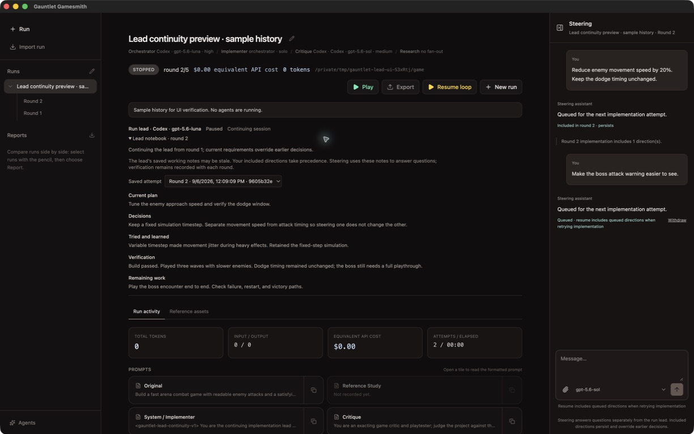

# Continuing lead and steering V1

Captured from the built Electron app in an isolated profile with seeded sample history.
No provider was running; the game actions and verification text shown are sample records.

The run is paused after round 2, with the same implementation session recorded across
both rounds. The expanded notebook shows its plan, decisions, failed experiment,
verification report, and remaining work. Steering shows one direction included in round 2
and another queued for an explicit implementation retry or the next implementation round.
The saved-attempt selector lets the operator inspect earlier notebook versions.
