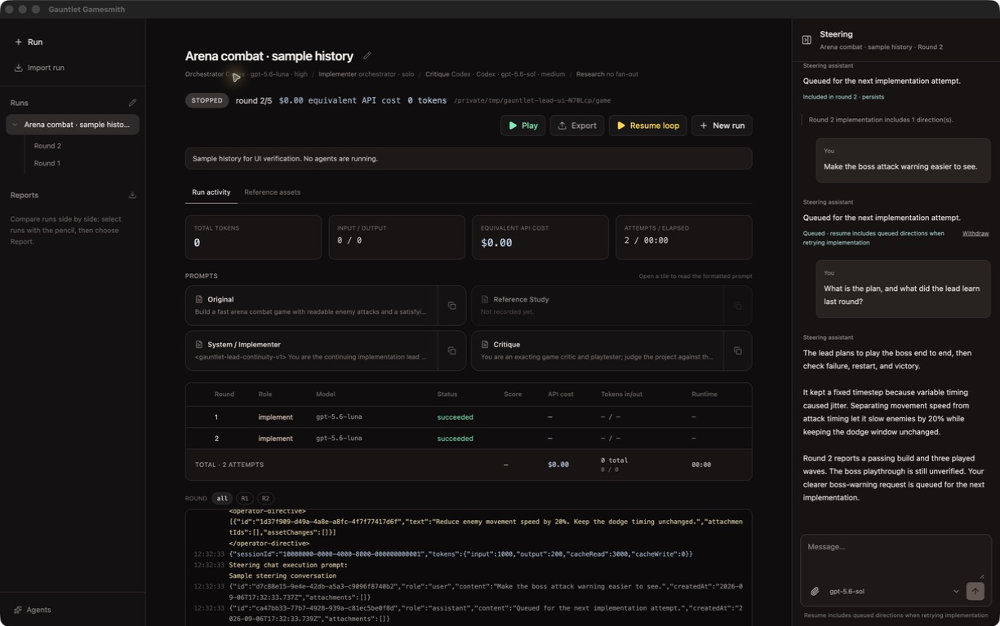

# Continuing lead in Steering chat

Captured from the built Electron app in an isolated profile with seeded sample history.
No provider was running; game actions, verification, and the assistant response are sample records.

The existing conversation answers a question about the current plan and what the lead learned.
Saved lead memory stays behind the scenes. There is no separate status strip, notebook panel,
or history selector. The chat still distinguishes included directions from queued changes.
